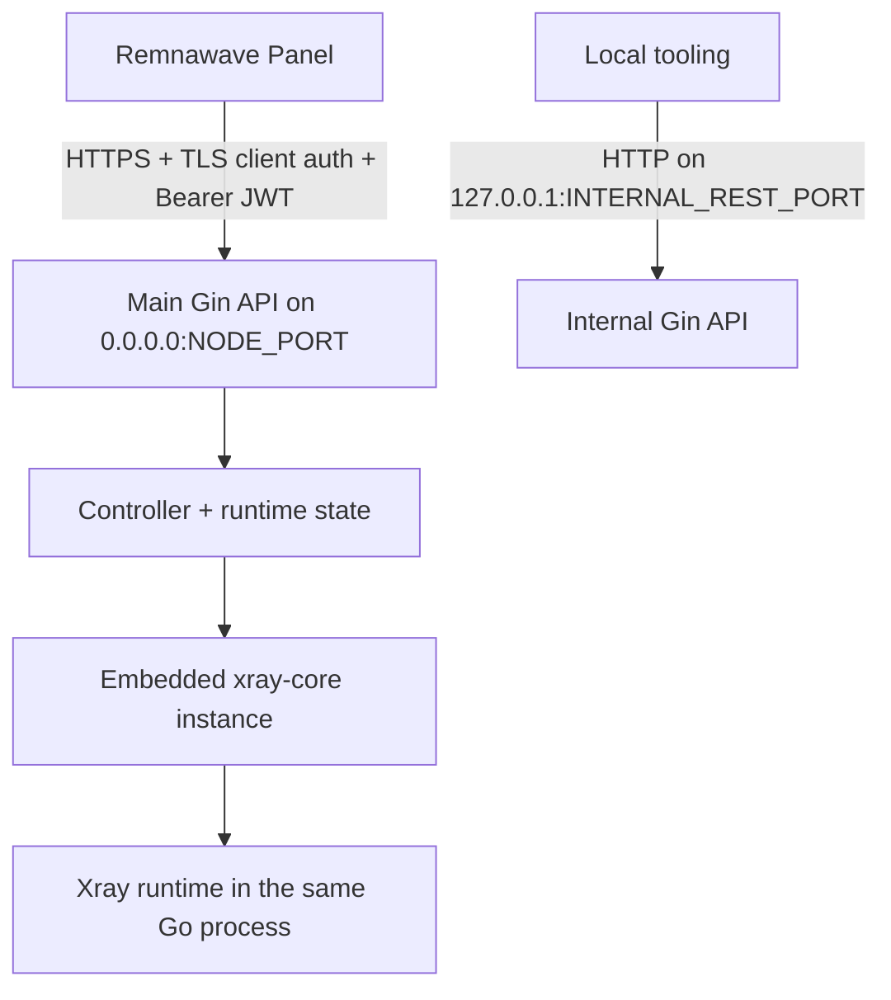

# rw-node-go

[](https://github.com/x-dora/rw-node-go/actions/workflows/ci.yml)
[](https://github.com/x-dora/rw-node-go/actions/workflows/preflight.yml)
[](https://github.com/x-dora/rw-node-go/actions/workflows/docker.yml)
[](https://github.com/x-dora/rw-node-go/releases)
[](LICENSE)

`rw-node-go` 是 Remnawave Node 兼容服务的 Go 实现，目标是对齐官方 [`remnawave/node`](https://github.com/remnawave/node) [`dev/2.8.0`](https://github.com/remnawave/node/tree/a5acdeb28840e21c2622a6362dc6824b6e70eea5) 面向 Panel 的 API contract。当前唯一运行模式是内嵌 [`xray-core`](https://github.com/XTLS/Xray-core)：Go 进程直接接收 Panel 下发的 Xray JSON config，并在同一进程内启动、停止和管理 Xray instance。

这不是外部 `xray` 进程包装器，也不把 Xray 配置作为主路径落盘。Plugin 相关路由只保留 Panel-facing contract adapter，避免 Panel 调用时返回 404，但不会产生官方 plugin side effects。

## 导航

- [一眼看懂](#一眼看懂)
- [能力快照](#能力快照)
- [快速开始](#快速开始)
- [运行配置](#运行配置)
- [运行结构](#运行结构)
- [目录导航](#目录导航)

## 一眼看懂

| 维度 | 当前状态 |
| --- | --- |
| 面向对象 | Remnawave Panel 和需要兼容官方 Node contract 的部署环境 |
| 当前主线 | 内嵌 `xray-core`、Gin HTTP 层、Panel-facing contract、受控真实 Panel live harness |
| 明确支持 | 主 API、internal API、基础统计、用户管理、Xray 生命周期 |
| 明确降级 | Xray feature、conntrack 或系统能力不可用时稳定退化 |
| 明确不做 | 外部 `xray` 进程、内部 gRPC inbound、internal mTLS、plugin 运行时状态、nftables 真实现 |

详细进度矩阵见 [docs/roadmap.md](docs/roadmap.md)。

## 公开面

| 面向 | 入口 | 说明 |
| --- | --- | --- |
| 主 API | `NODE_PORT` | 面向 Panel 的主服务。设置 `SECRET_KEY` 后走 HTTPS、TLS client auth 和 JWT 校验；未设置时只用于本地 HTTP 开发。 |
| Internal API | `INTERNAL_REST_PORT` | 仅本机可见的 internal REST API。 |
| Live Harness | [`scripts/panel-integration.sh`](scripts/panel-integration.sh) | 唯一真实 Panel 联调入口。 |
| Contract Drift | `mise run contract-diff` | 对照官方 [`remnawave/node`](https://github.com/remnawave/node) [`dev/2.8.0`](https://github.com/remnawave/node/tree/a5acdeb28840e21c2622a6362dc6824b6e70eea5) 的 contract 变化。 |

## 能力快照

<details open>
<summary>当前能力</summary>

- Gin HTTP 层、公开路由注册、contract struct、response envelope。
- `SECRET_KEY` 解析、PEM normalize、TLS client auth、JWT RS256、zstd request body。
- `/node/xray/start`、`/node/xray/stop`、`/node/xray/healthcheck` 的内嵌 Xray 生命周期。
- handler、stats 和连接清理的部分接入。
- Stats online status/IP 通过内嵌 Xray stats `OnlineMap` 读取，失败时稳定降级为 `false` 或空列表。
- Docker 构建、[CI](https://github.com/x-dora/rw-node-go/actions/workflows/ci.yml)、[release](https://github.com/x-dora/rw-node-go/releases)、[GHCR 镜像](https://github.com/x-dora/rw-node-go/pkgs/container/rw-node-go)和受控真实 Panel live harness。

</details>

<details>
<summary>当前明确不做</summary>

- 外部 `xray` 进程模式。
- Xray 配置落盘主路径。
- 内部 gRPC API inbound。
- plugin 运行时能力和状态持久化。
- nftables 真执行。

</details>

## 快速开始

本地开发最短路径：

```sh
mise install
mise run test
mise run lint
mise run build
```

启动本地服务：

```sh
cp .env.example .env
mise exec -- go run ./cmd/rw-node-go
```

主服务启动时会自动读取当前工作目录的 `.env`，真实系统环境变量优先级更高。开发模式下不设置 `SECRET_KEY` 时，主服务以本地 HTTP 模式启动，便于 route 和 contract 测试；设置 `SECRET_KEY` 后，主 API 启用 HTTPS、TLS client auth 和 JWT RS256 校验，所有 Panel-facing route 都必须携带 Bearer JWT。生产部署应提供 `SECRET_KEY`，或使用默认启用 `REQUIRE_SECRET_KEY=true` 的 Docker 镜像，让缺少密钥的容器直接启动失败。

发布前验证：

```sh
mise run preflight
```

真实 Panel live harness 只通过 [`scripts/panel-integration.sh`](scripts/panel-integration.sh) 触发。该流程会启用并禁用真实 Panel 测试节点，只能指向专用测试节点。

<details>
<summary>推荐的本地验证顺序</summary>

```sh
mise run fmt
mise run test
mise run lint
mise run build
mise run contract-diff
```

Docker 相关改动再补：

```sh
mise run docker-build
```

</details>

## 运行配置

裸进程启动时会先读取当前工作目录的 `.env`；`.env` 不存在时按环境变量和默认值启动。[`.env.example`](.env.example) 只用于主服务本地配置，真实 Panel live harness 使用独立的 `.env.integration.local`。

| 变量 | 默认值 | 说明 |
| --- | --- | --- |
| `NODE_PORT` | `2222` | Panel 访问节点 API 的端口。 |
| `INTERNAL_REST_PORT` | `61001` | 本机 internal REST API 端口，只监听 `127.0.0.1`。 |
| `SECRET_KEY` | 空 | 官方 Node 使用的 base64 JSON 密钥包；设置后启用 HTTPS、TLS client auth 和 JWT。 |
| `REQUIRE_SECRET_KEY` | `false` | 裸进程默认允许本地开发 HTTP；Docker 镜像默认设为 `true`。 |
| `NODE_TLS_CLIENT_AUTH` | `mtls` | 设置 `SECRET_KEY` 后的 TLS 客户端证书策略：`mtls` 要求并校验客户端证书，`optional` 在客户端提交证书时校验，`none` 只保留 HTTPS/JWT。 |
| `RW_NODE_DIR` | `/opt/rw-node-go` | 节点运行目录预留入口。 |
| `LOG_LEVEL` | `info` | 日志级别。 |
| `REQUEST_BODY_LIMIT_BYTES` | `1073741824` | request body 上限，默认 1 GiB。 |
| `XRAY_LOCATION_ASSET` | 空 | 主服务实际读取的 Xray geodata 目录；Docker 镜像固定设置为 `/usr/local/share/xray`。 |

`INTERNAL_REST_PORT` 只允许本机访问，不要通过 Docker publish、防火墙、FRP 或 PaaS 入站暴露到公网。

启动日志会输出脱敏运行摘要，包括项目版本、Panel 兼容版本、构建元信息、监听地址、TLS/JWT 状态、request body 上限和 Xray geodata 目录。普通主服务读取 `XRAY_LOCATION_ASSET`；真实 Panel live harness 的 `.env.integration.local` 使用 `XRAY_ASSET_DIR`，脚本启动节点时会转换为 `XRAY_LOCATION_ASSET`。日志只展示 Panel 下发 Xray 配置的结构摘要，例如 inbound/outbound/routing rule 数量、inbound tag、用户数量和缩短 hash。不会打印完整 Xray config、`SECRET_KEY`、JWT、公私钥、证书内容、bearer token 或用户凭据。

## 运行结构



<details>
<summary>运行边界</summary>

```text
Panel-facing contract
    -> main API
        -> controller
            -> embedded xray-core
                -> runtime feature and system fallback

local-only control plane
    -> internal API
```

</details>

设置 `SECRET_KEY` 后，主 API 通过 TLS server config、TLS client auth 和 JWT public key 校验 Panel 请求。默认 `NODE_TLS_CLIENT_AUTH=mtls`，保持官方 mTLS 行为。`NODE_TLS_CLIENT_AUTH=none` 只适用于前置可信代理已完成客户端证书校验的部署，例如 [Cloudflare API Shield mTLS](https://developers.cloudflare.com/api-shield/security/mtls/)；此时 Node 层仍会对所有 Panel-facing route 校验 JWT。官方 [`dev/2.8.0`](https://github.com/remnawave/node/tree/a5acdeb28840e21c2622a6362dc6824b6e70eea5) 已移除 `/vision/*` Panel-facing route，Go 侧同步返回 404。

不设置 `SECRET_KEY` 时，主 API 以本地 HTTP 模式启动，只用于开发和 contract 测试。Docker 镜像默认要求 `SECRET_KEY`。

## 目录导航

- [docs/architecture.md](docs/architecture.md)：架构分层、运行路径、运行时边界和 internal API 边界。
- [docs/contracts.md](docs/contracts.md)：Panel-facing contract 对齐、route 覆盖、stub 策略、golden fixture 和 contract drift 检查。
- [docs/development.md](docs/development.md)：本地开发、验证命令、真实 Panel harness、版本发布和实现规则。
- [docs/roadmap.md](docs/roadmap.md)：功能路线图和详细完成情况。
