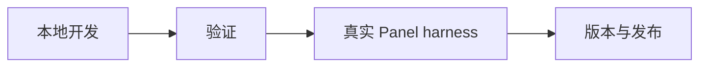

# 开发说明

本文档记录本项目的本地开发、验证、真实 Panel harness 和发布操作。项目定位和最短运行路径放在 `README.md`；详细功能进度矩阵放在 `docs/roadmap.md`。

## 1. 本地开发

项目使用 `mise` 管理 Go 版本和常用任务：

```sh
mise install
```

常用命令：

```sh
mise run fmt
mise run test
mise run build
mise run docker-build
mise run preflight
```

`mise run lint` 依赖本地已安装 `golangci-lint`。

`mise run build` 通过 `cmd/rw-build` 读取根目录 `VERSION`，再注入 `ProjectVersion`、`Commit` 和 `BuildDate`。CI、Docker 和 release workflow 也走同一入口，避免本地和发布产物出现不同版本语义。

开发模式可以不设置 `SECRET_KEY`，此时主服务使用 HTTP，便于 route 和 contract 测试：

```sh
cp .env.example .env
mise exec -- go run ./cmd/rw-node-go
```

主服务启动时会自动读取当前工作目录的 `.env`，但不会覆盖已经存在的系统环境变量。`.env` 只用于普通本地启动；真实 Panel harness 继续使用 `.env.integration.local`，并且只能通过 `scripts/panel-integration.sh` 触发。

设置 `SECRET_KEY` 后会启用 HTTPS、mTLS 和 JWT RS256 校验；官方 `/vision/*` route 只豁免 Bearer JWT，仍保留 mTLS。`SECRET_KEY` 内容不得写入日志、测试输出或文档示例。

发布前本地验证：

```sh
mise run preflight
```



## 2. 验证

- 新增 route、公开 contract struct 或 response shape 时必须补单元测试。
- 从 stub 进入真实 Xray 行为时，应补 integration test 或明确记录无法在 CI 中验证的原因。
- mTLS/JWT/zstd、response envelope、router、config builder 和 embedded core 属于基础能力，修改时必须跑完整测试。
- contract golden 应只保存必要 fixture，避免复制大段上游源码。
- 计划文档和官方 `tmp/remnawave-node` 实现冲突时，以官方仓库为准，并同步修正文档中的错误假设。

建议验证顺序：

```sh
mise run fmt
mise run test
mise run build
mise run contract-diff
```

涉及 Docker 的改动再运行：

```sh
mise run docker-build
```

## 3. 真实 Panel harness

真实 Panel 对接联调不是 `go test` 测试，它只能通过 `scripts/panel-integration.sh` 触发。它用于在接近生产的运行方式下启动本地 `rw-node-go`，连接外部 Remnawave Panel，并产出适合人工和 agent 阅读的结构化日志。它会对真实 Panel 节点执行 enable/disable 操作，只应指向专门用于联调的测试节点。

先把根目录 `.env.integration.example` 复制为 `.env.integration.local`，填写 `PANEL_BASE_URL`、`PANEL_API_KEY`、`PANEL_NODE_ID` 和 Panel 生成给当前节点的 `SECRET_KEY`。`run`、`enable` 和 `disable` 会修改真实 Panel 节点状态，`PANEL_NODE_ID` 必须是完整节点 UUID；只有只读的 `node` 命令允许使用能唯一匹配一个节点的 UUID/name/address 片段。`NODE_PORT` 必须和 Panel 上该节点的端口一致，否则 Panel 会连到错误端口。默认 smoke 接口是 `/api/system/metadata`；如需替换，把 `PANEL_SMOKE_PATH` 改成一个低风险、可鉴权的只读接口。

内嵌 `xray-core` 需要 `geoip.dat` 和 `geosite.dat`。本地联调默认从 `runtime/xray/` 读取，也可以通过 `XRAY_ASSET_DIR` 指到其他目录。Release 和 Docker workflow 会按 Xray-core 的方式从 `Loyalsoldier/v2ray-rules-dat` release 分支下载并校验这两个文件；本地手动联调时也应保持文件名不变：

```text
runtime/xray/geoip.dat
runtime/xray/geosite.dat
```

`runtime/` 是本地私有运行目录，不提交到 git。Docker 镜像内已预置 `/usr/local/share/xray/geoip.dat` 和 `/usr/local/share/xray/geosite.dat`，并设置 `XRAY_LOCATION_ASSET=/usr/local/share/xray`，这也是 Xray 官方常用的 asset 位置。

常用命令：

```sh
bash scripts/panel-integration.sh summary
bash scripts/panel-integration.sh run
bash scripts/panel-integration.sh node
bash scripts/panel-integration.sh enable
bash scripts/panel-integration.sh disable
bash scripts/panel-integration.sh status
bash scripts/panel-integration.sh stop
```

`summary` 会输出脱敏配置摘要，并标记 `geoip.dat` 和 `geosite.dat` 是否存在。`node` 只读取 Panel 上当前节点的状态摘要，重点看 `connected`、`connecting`、`disabled` 和 `last_status_message`。

`run` 是完整 live harness：它先构建本地二进制到 `runtime/bin/`，启动本地节点，然后调用 Panel API `POST /api/nodes/{uuid}/actions/enable` 启用当前节点，并轮询 `GET /api/nodes/{uuid}`，直到 Panel 返回 `isConnected=true` 且 `isDisabled=false`。如果 Panel 没有连上节点，`run` 会失败并打印脱敏后的最后一次 `lastStatusMessage`。正常结束时脚本会显式调用 `POST /api/nodes/{uuid}/actions/disable` 并轮询确认 `isDisabled=true`；如果 disable 失败，`run` 返回非零。失败或中断时 EXIT trap 仍会兜底尝试 disable 和 stop，并在清理失败时输出 `panel_node_disable_cleanup_failed` 或 `node_stop_cleanup_failed`。

`enable` 和 `disable` 是单独的调试入口。`enable` 会启用 Panel 节点并等待 Panel 报告已连接；`disable` 会禁用 Panel 节点。手动使用 `start` 后，应在结束前执行 `disable` 和 `stop`。

节点 stdout/stderr 会写入 `logs/panel-integration/`，脚本自身和 `internal/testkit` 的 Panel client 会输出 JSON 事件，包含请求耗时、HTTP 状态、响应大小、错误分类和响应摘要 hash。日志会脱敏 `SECRET_KEY`、API key、token、私钥、证书字段、Bearer/JWT-like 文本、PEM block 和常见自由文本 key/value 片段。

脚本会在日志目录写入 `rw-node-go.pid.json`，其中记录 pid、二进制路径、启动时间和 harness marker。`stop` 只会停止能验证为该 harness 启动的进程；发现旧格式或陈旧 pid 文件时会拒绝发送 SIGTERM，并提示人工确认后删除 pid 文件。

脚本内部会调用 `cmd/panel-integration`。这个 Go 命令是脚本专用 harness，不是公开入口；直接 `go run ./cmd/panel-integration ...` 会失败并提示改用 `scripts/panel-integration.sh`。普通 `go test ./...` 不会连接真实 Panel。

<details>
<summary>联调前检查</summary>

- `PANEL_BASE_URL`
- `PANEL_API_KEY`
- `PANEL_NODE_ID`
- `SECRET_KEY`
- `NODE_PORT`
- `XRAY_ASSET_DIR`

</details>

## 4. 版本与发布

项目发布版本和 Panel 兼容版本必须分开维护：

- 根目录 `VERSION` 是 `rw-node-go` 自己的发布版本，使用语义化版本，当前从 `1.0.1` 开始。
- `internal/version.ProjectVersion` 由 `VERSION` 通过构建参数注入，用于日志、release 和镜像元信息。
- `internal/version.NodeVersion` 是 Panel-facing `nodeVersion`，默认固定为 `2.7.0`，只代表兼容官方 `remnawave/node` 2.7.x contract。除非明确跟随上游 contract 升级，否则不要改它。

`golang:1.26.2-alpine` 是 Docker build 使用的固定基础镜像，和 `.mise.toml` 的 Go 版本对齐；release 流程仍按 `go.mod` 选择 Go 工具链，但构建元信息注入逻辑与本地、CI、Docker 保持一致。

GitHub Actions 发布流程：

- `CI`：push 和 pull request 跑测试与二进制构建。
- `Docker`：push、pull request 和手动触发时只构建多架构镜像，不推送。
- `Preflight`：手动或 release 调用，执行 `go fmt` 检查、`mise run test`、`mise run build` 和 `mise run contract-diff`；可选运行真实 Panel live harness。
- `Scheduled assets update`：每天按 Xray-core 的 geodat 流程下载 `geoip.dat` 和 `geosite.dat`，校验上游 sha256，并缓存到 `resources/`。
- `Release`：`main` 每次 push 先跑 Preflight。若 `VERSION` 没变且对应正式 tag 已存在，会更新滚动 `pre-release` 的 release notes 和 Linux `tar.gz` 资产；若 `VERSION` 变化，会先推 GHCR 镜像，成功后再创建 `v<VERSION>` 正式 release 并上传 Linux `tar.gz` 资产。Release workflow 还提供 `republish_existing_release=true` 的手动恢复入口，只补推已有正式 release 对应的镜像，不会改动 GitHub Release。

正式发版只需要修改 `VERSION` 并推送到 `main`。正式 tag 已存在时 workflow 会失败，不会覆盖历史 release。发布资产包命名为 `rw-node-go-linux-64.tar.gz` 和 `rw-node-go-linux-arm64-v8a.tar.gz`，包内包含 `rw-node-go`、`geoip.dat`、`geosite.dat`、`README.md` 和 `LICENSE`，并附带 `.dgst` 校验文件。GHCR 推送直接使用 `github.token` 登录，不需要额外的发布 secret，但还需要在 GitHub Packages 里给 `ghcr.io/x-dora/rw-node-go` 授予本仓库的写入或继承权限，否则 workflow 会在 Docker push 阶段失败并提示 `write_package` 问题。

本地发布前验证：

```sh
mise run preflight
```

真实 Panel 验证：

```sh
RUN_PANEL_INTEGRATION=true mise run preflight
```

真实 Panel harness 会修改测试节点状态，必须使用完整测试节点 UUID，并确认结束时 disable 节点。

## 5. 实现规则

- HTTP 层使用 Gin，main route 和 internal route 注册集中在 `internal/httpapi/router.go`。
- Panel-facing response 使用 `httpapi.WriteEnvelope`。
- Internal API 可以直接返回 JSON 对象，不套 Panel envelope。
- 新增公开请求或响应类型放在 `internal/contracts`。
- 当前唯一 Xray runtime 是内嵌 `xray-core`；不要重新引入外部进程模式、Xray gRPC API、internal mTLS 或配置落盘主路径。
- Xray 相关能力优先通过 `internal/xray` 抽象实现。
- system、conntrack、nftables 能力放在 `internal/system`，权限不足时应稳定降级。
- Vision block/unblock 通过内嵌 routing feature 实现 source IP dynamic rule，不通过 Xray gRPC RoutingService。
- plugin 只做 contract adapter；不要保存 plugin runtime state、注入 Xray plugin config、接收 webhook、触发 Xray restart 或执行 nftables。
- 不新增公开 `pkg` API，除非明确决定把项目的一部分作为 Go library 发布。
